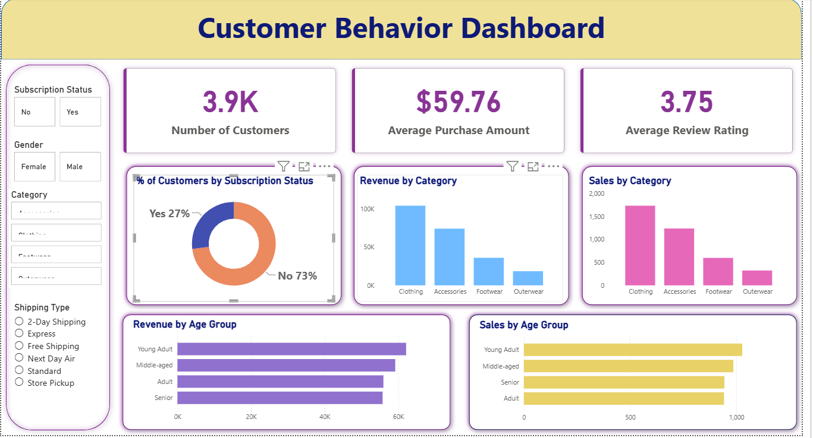
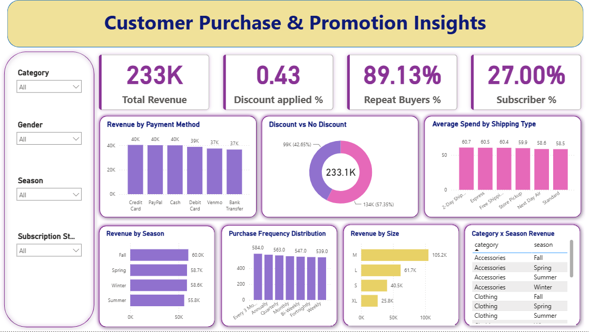

# Customer Shopping Behavior Analysis

## Project Overview

This project analyzes customer shopping behavior using SQL, Python, and Power BI to uncover insights related to revenue, customer demographics, subscriptions, discounts, seasonal trends, and purchasing patterns.

---

## Objectives

- Analyze customer purchasing behavior
- Understand subscriber vs non-subscriber spending
- Evaluate discount effectiveness
- Identify revenue trends across categories and seasons
- Segment customers based on buying patterns

---

## Tools & Technologies

- SQL
- Python
- Pandas
- NumPy
- Power BI
- Excel
- Jupyter Notebook

---

## Dataset Features

- Customer ID
- Age Group
- Gender
- Category
- Purchase Amount
- Subscription Status
- Shipping Type
- Payment Method
- Discount Applied
- Previous Purchases
- Review Ratings
- Season

---

## SQL Analysis

Performed business queries including:

- Revenue by gender
- Subscriber analysis
- Discount impact
- Customer segmentation
- Top products
- Age group revenue
- Repeat buyer analysis

---

## Power BI Dashboards

### Customer Behavior Dashboard

### Customer Purchase & Promotion Insights

---

## Key Insights

- Subscribers contribute significantly to total revenue.
- Clothing and Accessories generate the highest sales.
- Young Adults contribute the highest revenue.
- Discount campaigns influence purchasing behavior.
- Payment methods show nearly equal usage patterns.

